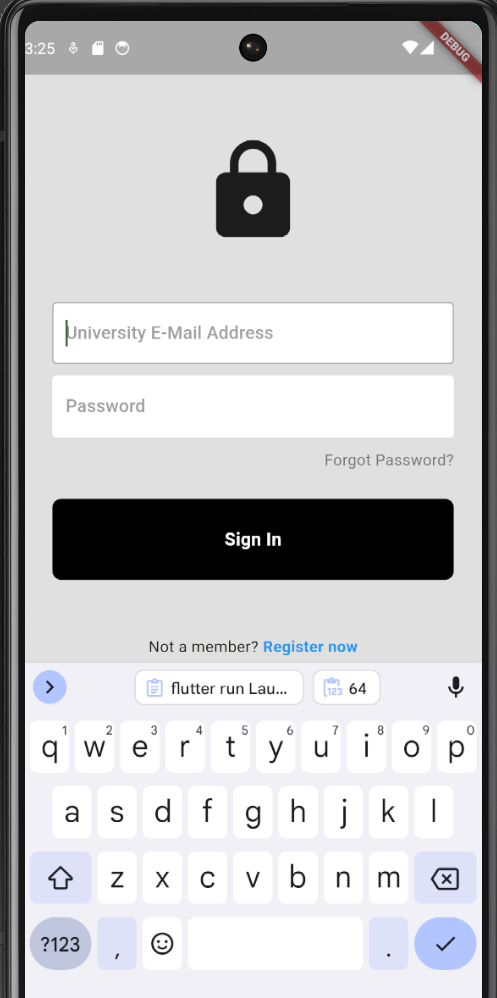
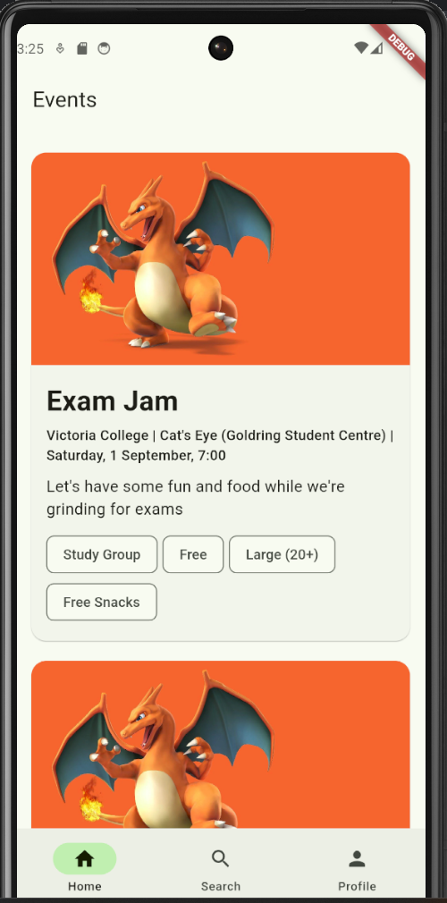
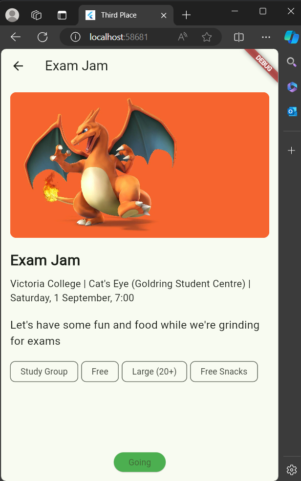

# Third Place App
Note: This application is currently being developed! New features and a public release are in the works. The code is hidden in a private repository and is available upon request.

A university event management app built with Flutter and Firebase, where clubs can post events, and students can mark their attendance. The app allows students to see upcoming events, search by tags, view event details, and mark themselves as "Going".

## Features
- **Event Listings**: View a centralized board of university events.
- **Search**: Filter events by tags.
- **Mark Attendance**: Mark yourself as "Going" and see other attendees.
- **Event Details**: View full event details, including date, time, location, and description.
  
## Technologies Used
- **Flutter** for front-end UI.
- **Firebase Firestore** for event and attendance data storage.
- **Firebase Authentication** for user login via email.
- **Provider** for state management across the app.

## Screenshots

